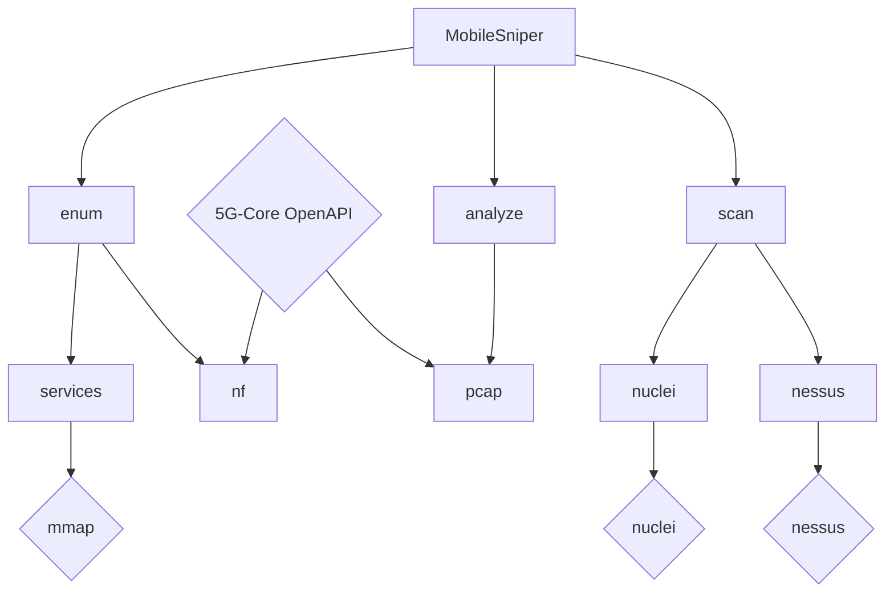

# Architecture 

Software architecture refers to the high-level structure of a system, defining its components and how they interact with each other. In the context of a penetration testing tool, the architecture outlines the organization of the tool's various modules, processes, and data flows. It serves as a blueprint that guides the design and development, ensuring scalability, maintainability, and performance. A well-defined software architecture helps in efficiently addressing complex requirements and integrating necessary features while allowing for flexibility in future enhancements or updates.

The follwoing diagram visualize the implemented commands and required external tools and definitions (diamond). 

